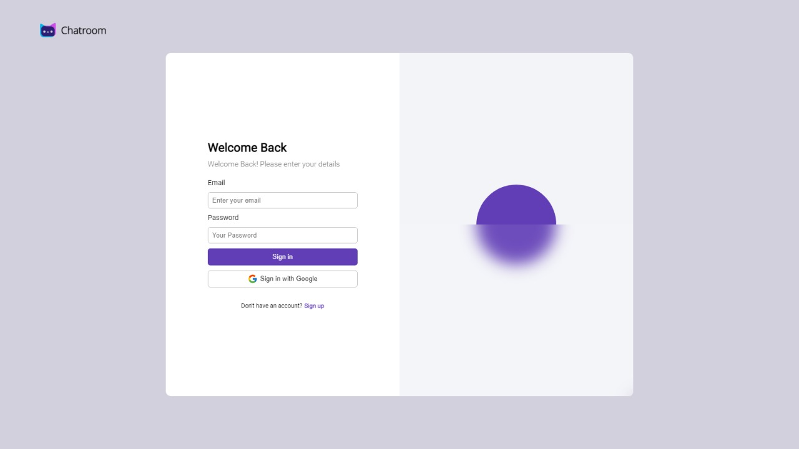
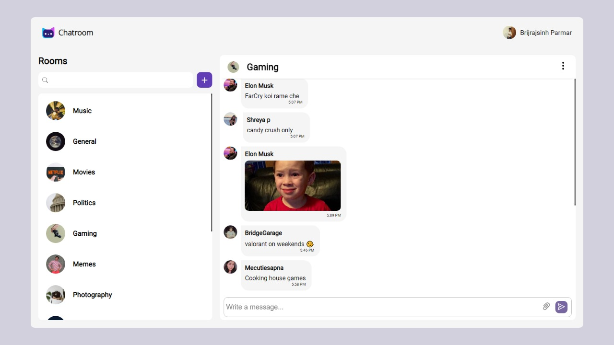
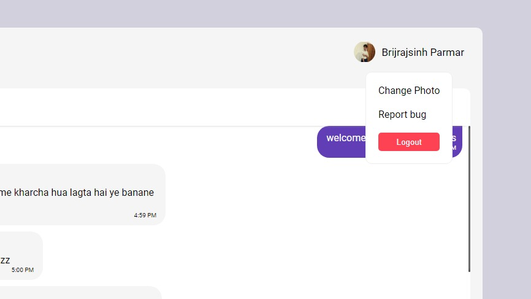
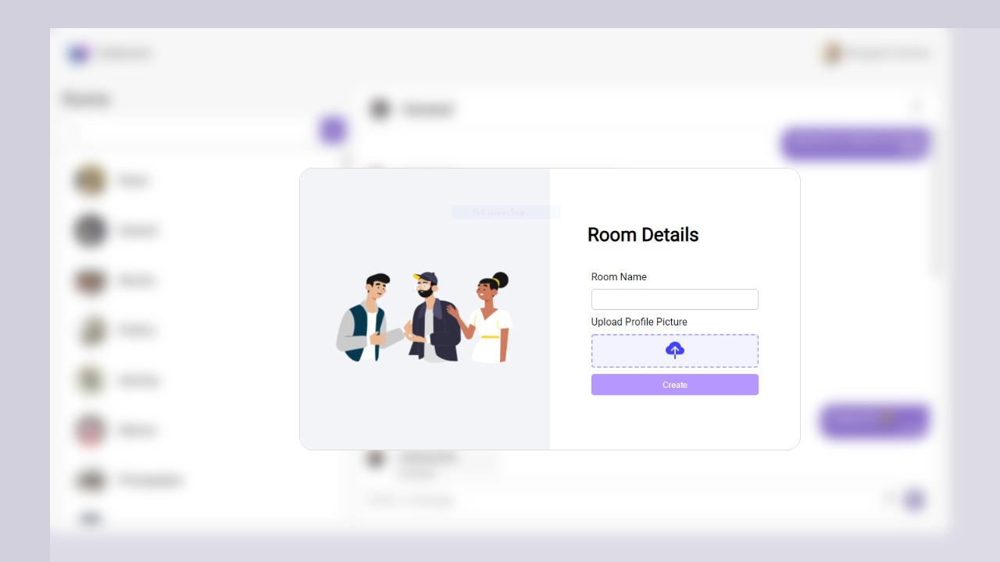

# CollabCraze

A Private and Free Community Driven Chatting Application.

Made using ReactJs and Firebase

## Overview
1. *Minimal UI*: A beautiful, minimalist user interface with subtle animations.
2. *Send Texts and images*: Converse with people send images and Texts in groups.
3. *Custom rooms*: Create Custom Rooms to build Communities.
4. *Change Profile Picture*: Put up your custom Display Image.
5. *Search Groups*: Search and Join Communities you care about.

## Sneak peek

## Dependencies
 - firebase
 - framer-motion
 - react-icons

## Download or Run the project
- With Nodejs installed, clone project and run `npm install` and `npm run dev` in that directory,
or
- Visit the Hosted site from [here]( )

   
Feedback is welcome! Contact me for any info.  
Made with ❤ by  Pratik Mohite

CommunityChat  ---- git remote set-url origin https://github.com/Pratik2512/CommunityChat.git